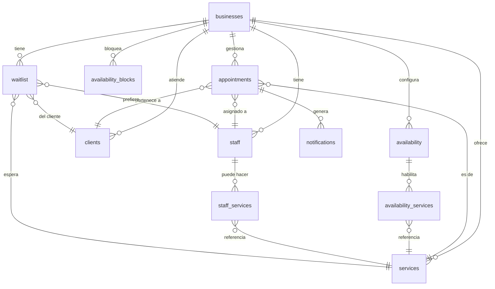

# Modelo de datos

Esquema PostgreSQL gestionado con Drizzle ORM. Código fuente en `packages/db/src/schema/`.

---

## Diagrama de relaciones

```
businesses
    │
    ├──< staff             (un negocio tiene muchos empleados)
    │       └──< staff_services ──> services
    │
    ├──< services          (un negocio tiene muchos servicios)
    │
    ├──< clients           (un negocio tiene muchos clientes)
    │
    ├──< appointments      (un negocio tiene muchos turnos)
    │       ├──> services
    │       ├──> staff
    │       ├──> clients
    │       └──< notifications
    │
    ├──< availability      (disponibilidad horaria del negocio)
    │       └──< availability_services ──> services
    │
    └──< availability_blocks  (bloqueos puntuales de agenda)

waitlist ──> businesses, services, staff, clients
audit_logs  (tabla independiente, sin FK)
```

### Diagrama Mermaid



---

## Tablas

### `businesses`

Representa a un profesional o negocio registrado en la plataforma. Es la entidad raíz: todo el resto del esquema se relaciona con ella.

| Columna                    | Tipo                      | Nullable | Default                            | Descripción                                                       |
|----------------------------|---------------------------|----------|------------------------------------|-------------------------------------------------------------------|
| `id`                       | `uuid`                    | No       | `gen_random_uuid()`                | PK                                                                |
| `owner_id`                 | `uuid`                    | No       | —                                  | FK implícita al usuario de Supabase Auth                          |
| `name`                     | `varchar(255)`            | No       | —                                  | Nombre del negocio                                                |
| `slug`                     | `varchar(100)`            | No       | —                                  | URL pública del negocio. Único. Ej: `"ana-garcia-4x2k"`           |
| `category`                 | `varchar(100)`            | Sí       | —                                  | Categoría del negocio. Ej: `"peluquería"`, `"psicología"`         |
| `timezone`                 | `varchar(100)`            | No       | `"America/Argentina/Buenos_Aires"` | Zona horaria del negocio                                          |
| `phone`                    | `varchar(30)`             | Sí       | —                                  | Teléfono de contacto                                              |
| `email`                    | `varchar(255)`            | Sí       | —                                  | Email de contacto (tomado del usuario al crear)                   |
| `address`                  | `varchar(500)`            | Sí       | —                                  | Dirección física                                                  |
| `cancellation_policy_hours`| `integer`                 | No       | `24`                               | Horas mínimas para cancelar sin penalidad                         |
| `booking_advance_min_hours`| `integer`                 | No       | `1`                                | Anticipación mínima en horas para hacer una reserva               |
| `whatsapp_phone_number_id` | `varchar(100)`            | Sí       | —                                  | ID del número de teléfono en Meta Cloud API (Fase 2)              |
| `whatsapp_waba_id`         | `varchar(100)`            | Sí       | —                                  | WhatsApp Business Account ID (Fase 2)                             |
| `whatsapp_access_token`    | `varchar(500)`            | Sí       | —                                  | Token de acceso de Meta. Encriptado en reposo (Fase 2)            |
| `whatsapp_connected_at`    | `timestamptz`             | Sí       | —                                  | Fecha de conexión de WhatsApp                                     |
| `config`                   | `jsonb`                   | No       | `{}`                               | Configuración extra del negocio (extensible sin migraciones)      |
| `created_at`               | `timestamptz`             | No       | `now()`                            |                                                                   |
| `updated_at`               | `timestamptz`             | No       | `now()`                            |                                                                   |
| `deleted_at`               | `timestamptz`             | Sí       | —                                  | Soft-delete. Registros con valor no nulo no se muestran al público |

---

### `staff`

Miembros del equipo de un negocio. Al crear un negocio se inserta automáticamente un staff que representa al dueño. Los turnos siempre se asignan a un staff.

| Columna      | Tipo           | Nullable | Default             | Descripción                        |
|--------------|----------------|----------|---------------------|------------------------------------|
| `id`         | `uuid`         | No       | `gen_random_uuid()` | PK                                 |
| `business_id`| `uuid`         | No       | —                   | FK → `businesses.id`               |
| `name`       | `varchar(255)` | No       | —                   | Nombre del empleado                |
| `email`      | `varchar(255)` | Sí       | —                   |                                    |
| `phone`      | `varchar(30)`  | Sí       | —                   |                                    |
| `avatar_url` | `varchar(500)` | Sí       | —                   | URL de foto de perfil              |
| `is_active`  | `boolean`      | No       | `true`              |                                    |
| `created_at` | `timestamptz`  | No       | `now()`             |                                    |
| `updated_at` | `timestamptz`  | No       | `now()`             |                                    |
| `deleted_at` | `timestamptz`  | Sí       | —                   | Soft-delete                        |

---

### `services`

Servicios que ofrece el negocio. Cada servicio tiene su duración y precio independiente.

| Columna           | Tipo                         | Nullable | Default             | Descripción                                                      |
|-------------------|------------------------------|----------|---------------------|------------------------------------------------------------------|
| `id`              | `uuid`                       | No       | `gen_random_uuid()` | PK                                                               |
| `business_id`     | `uuid`                       | No       | —                   | FK → `businesses.id`                                             |
| `name`            | `varchar(255)`               | No       | —                   | Nombre del servicio. Ej: `"Corte de cabello"`                    |
| `description`     | `varchar(1000)`              | Sí       | —                   |                                                                  |
| `duration_minutes`| `integer`                    | No       | —                   | Duración del servicio en minutos                                 |
| `buffer_minutes`  | `integer`                    | No       | `0`                 | Tiempo de buffer post-turno en minutos (limpieza, descanso, etc.)|
| `price`           | `numeric(10,2)`              | Sí       | —                   | Precio. `NULL` si el servicio es gratuito o de precio a convenir |
| `currency`        | `varchar(3)`                 | Sí       | `"ARS"`             | Código ISO 4217                                                  |
| `max_per_day`     | `integer`                    | Sí       | —                   | Límite diario de este servicio. `NULL` = sin límite              |
| `is_active`       | `boolean`                    | No       | `true`              | Solo los servicios activos se muestran en la reserva pública     |
| `created_at`      | `timestamptz`                | No       | `now()`             |                                                                  |
| `updated_at`      | `timestamptz`                | No       | `now()`             |                                                                  |
| `deleted_at`      | `timestamptz`                | Sí       | —                   | Soft-delete                                                      |

**Nota sobre el slot de disponibilidad:** El tiempo total que ocupa un turno en la agenda es `duration_minutes + buffer_minutes`. El buffer no se muestra al cliente.

---

### `staff_services`

Tabla de unión que indica qué servicios puede realizar cada miembro del staff. Actualmente no se usa en la lógica de reserva (todos los servicios van al staff por defecto), pero está modelada para Fase 2.

| Columna     | Tipo   | Nullable | Descripción            |
|-------------|--------|----------|------------------------|
| `staff_id`  | `uuid` | No       | FK → `staff.id`        |
| `service_id`| `uuid` | No       | FK → `services.id`     |

PK compuesta: `(staff_id, service_id)`.

---

### `clients`

Clientes del negocio. El identificador único de un cliente es `(business_id, phone)`: si un cliente reserva dos veces con el mismo teléfono, se usa el mismo registro.

| Columna      | Tipo           | Nullable | Default             | Descripción                               |
|--------------|----------------|----------|---------------------|-------------------------------------------|
| `id`         | `uuid`         | No       | `gen_random_uuid()` | PK                                        |
| `business_id`| `uuid`         | No       | —                   | FK → `businesses.id`                      |
| `name`       | `varchar(255)` | No       | —                   | Nombre del cliente                        |
| `email`      | `varchar(255)` | Sí       | —                   | Email. Opcional en la reserva pública     |
| `phone`      | `varchar(30)`  | Sí       | —                   | Teléfono. Usado para deduplicar clientes  |
| `notes`      | `text`         | Sí       | —                   | Notas internas del profesional            |
| `created_at` | `timestamptz`  | No       | `now()`             |                                           |
| `updated_at` | `timestamptz`  | No       | `now()`             |                                           |
| `deleted_at` | `timestamptz`  | Sí       | —                   | Soft-delete                               |

---

### `appointments`

Turno individual. Núcleo del sistema.

| Columna              | Tipo                     | Nullable | Default             | Descripción                                                             |
|----------------------|--------------------------|----------|---------------------|-------------------------------------------------------------------------|
| `id`                 | `uuid`                   | No       | `gen_random_uuid()` | PK                                                                      |
| `business_id`        | `uuid`                   | No       | —                   | FK → `businesses.id`                                                    |
| `service_id`         | `uuid`                   | No       | —                   | FK → `services.id`                                                      |
| `staff_id`           | `uuid`                   | No       | —                   | FK → `staff.id`                                                         |
| `client_id`          | `uuid`                   | No       | —                   | FK → `clients.id`                                                       |
| `start_at`           | `timestamptz`            | No       | —                   | Inicio del turno (con timezone)                                         |
| `end_at`             | `timestamptz`            | No       | —                   | Fin del turno (sin buffer)                                              |
| `status`             | `appointment_status`     | No       | `"pending"`         | Ver máquina de estados más abajo                                        |
| `notes`              | `text`                   | Sí       | —                   | Notas del profesional sobre el turno                                    |
| `price_snapshot`     | `numeric(10,2)`          | Sí       | —                   | Precio en el momento de la reserva (inmutable aunque cambie el servicio)|
| `currency_snapshot`  | `varchar(3)`             | Sí       | —                   | Moneda en el momento de la reserva                                      |
| `rescheduled_from_id`| `uuid`                   | Sí       | —                   | ID del turno original al reprogramar                                    |
| `cancelled_at`       | `timestamptz`            | Sí       | —                   | Timestamp de cancelación                                                |
| `cancelled_by`       | `varchar(20)`            | Sí       | —                   | `"client"` \| `"professional"` \| `"system"`                            |
| `cancel_reason`      | `text`                   | Sí       | —                   | Motivo de cancelación                                                   |
| `payment_proof_url`  | `varchar(1000)`          | Sí       | —                   | URL pública en Supabase Storage (bucket `payment-proofs`)               |
| `created_at`         | `timestamptz`            | No       | `now()`             |                                                                         |
| `updated_at`         | `timestamptz`            | No       | `now()`             |                                                                         |
| `deleted_at`         | `timestamptz`            | Sí       | —                   | Soft-delete                                                             |

---

### `availability`

Disponibilidad horaria recurrente por día de la semana. Cuando `staff_id IS NULL`, aplica al negocio completo. Cuando tiene valor, aplica solo a ese miembro del staff (Fase 2).

| Columna      | Tipo           | Nullable | Default             | Descripción                                               |
|--------------|----------------|----------|---------------------|-----------------------------------------------------------|
| `id`         | `uuid`         | No       | `gen_random_uuid()` | PK                                                        |
| `business_id`| `uuid`         | No       | —                   | FK → `businesses.id`                                      |
| `staff_id`   | `uuid`         | Sí       | —                   | FK → `staff.id`. `NULL` = disponibilidad del negocio      |
| `day_of_week`| `day_of_week`  | No       | —                   | Ver enum más abajo                                        |
| `start_time` | `time`         | No       | —                   | Hora de apertura. Ej: `"09:00"`                           |
| `end_time`   | `time`         | No       | —                   | Hora de cierre. Ej: `"18:00"`                             |
| `is_active`  | `boolean`      | No       | `true`              | Si el negocio atiende ese día de la semana                |
| `created_at` | `timestamptz`  | No       | `now()`             |                                                           |

---

### `availability_services`

Qué servicios están habilitados para cada franja horaria de disponibilidad. PK compuesta: `(availability_id, service_id)`.

| Columna           | Tipo      | Nullable | Default | Descripción                                       |
|-------------------|-----------|----------|---------|---------------------------------------------------|
| `availability_id` | `uuid`    | No       | —       | FK → `availability.id` (cascade delete)           |
| `service_id`      | `uuid`    | No       | —       | FK → `services.id` (cascade delete)               |
| `is_enabled`      | `boolean` | No       | `true`  |                                                   |

---

### `availability_blocks`

Bloqueos puntuales de agenda (vacaciones, feriados, ausencias). Tiene precedencia sobre la disponibilidad recurrente. Actualmente en el esquema pero sin lógica de negocio implementada.

| Columna      | Tipo          | Nullable | Default             | Descripción                                          |
|--------------|---------------|----------|---------------------|------------------------------------------------------|
| `id`         | `uuid`        | No       | `gen_random_uuid()` | PK                                                   |
| `business_id`| `uuid`        | No       | —                   | FK → `businesses.id`                                 |
| `staff_id`   | `uuid`        | Sí       | —                   | FK → `staff.id`. `NULL` = bloqueo para todo el negocio |
| `starts_at`  | `timestamptz` | No       | —                   |                                                      |
| `ends_at`    | `timestamptz` | No       | —                   |                                                      |
| `reason`     | `uuid`        | Sí       | —                   | Campo en revisión — tipado incorrecto en el esquema actual |
| `created_at` | `timestamptz` | No       | `now()`             |                                                      |

---

### `notifications`

Registro de cada notificación enviada (o con intento de envío) asociada a un turno.

| Columna        | Tipo                    | Nullable | Default             | Descripción                                                   |
|----------------|-------------------------|----------|---------------------|---------------------------------------------------------------|
| `id`           | `uuid`                  | No       | `gen_random_uuid()` | PK                                                            |
| `appointment_id`| `uuid`                 | No       | —                   | FK → `appointments.id`                                        |
| `channel`      | `notification_channel`  | No       | —                   | Ver enum más abajo                                            |
| `event`        | `notification_event`    | No       | —                   | Ver enum más abajo                                            |
| `recipient_type`| `varchar(20)`          | No       | —                   | `"client"` \| `"professional"`                                 |
| `recipient_id` | `uuid`                  | No       | —                   | ID del cliente o staff destinatario                           |
| `status`       | `notification_status`   | No       | `"pending"`         | Ver enum más abajo                                            |
| `external_id`  | `varchar(255)`          | Sí       | —                   | Message ID de Meta Cloud API o de Resend                      |
| `error_message`| `text`                  | Sí       | —                   | Error del proveedor en caso de fallo                          |
| `attempt_count`| `integer`               | No       | `0`                 | Cantidad de intentos de envío                                 |
| `scheduled_at` | `timestamptz`           | Sí       | —                   | Para notificaciones diferidas (recordatorios)                 |
| `sent_at`      | `timestamptz`           | Sí       | —                   |                                                               |
| `created_at`   | `timestamptz`           | No       | `now()`             |                                                               |

---

### `waitlist`

Lista de espera para un servicio en una fecha específica. Cuando se libera un slot, el sistema notifica al cliente y le da una ventana de tiempo para confirmar.

| Columna        | Tipo          | Nullable | Default             | Descripción                                             |
|----------------|---------------|----------|---------------------|---------------------------------------------------------|
| `id`           | `uuid`        | No       | `gen_random_uuid()` | PK                                                      |
| `business_id`  | `uuid`        | No       | —                   | FK → `businesses.id`                                    |
| `service_id`   | `uuid`        | No       | —                   | FK → `services.id`                                      |
| `staff_id`     | `uuid`        | Sí       | —                   | FK → `staff.id`. `NULL` = sin preferencia de staff      |
| `client_id`    | `uuid`        | No       | —                   | FK → `clients.id`                                       |
| `requested_date`| `date`       | No       | —                   | Fecha deseada                                           |
| `status`       | `varchar(20)` | No       | `"waiting"`         | `"waiting"` \| `"notified"` \| `"booked"` \| `"expired"` |
| `notified_at`  | `timestamptz` | Sí       | —                   | Cuando se notificó al cliente                           |
| `expires_at`   | `timestamptz` | Sí       | —                   | Ventana de 30 minutos para confirmar tras la notificación|
| `created_at`   | `timestamptz` | No       | `now()`             |                                                         |

---

### `audit_logs`

Log de auditoría de acciones sobre entidades del sistema. No tiene FK hacia otras tablas para evitar dependencias y poder escribir aunque la entidad ya no exista.

| Columna     | Tipo           | Nullable | Descripción                                           |
|-------------|----------------|----------|-------------------------------------------------------|
| `id`        | `uuid`         | No       | PK                                                    |
| `actor_id`  | `uuid`         | Sí       | ID del usuario, cliente o proceso que realizó la acción|
| `actor_type`| `varchar(30)`  | Sí       | `"client"` \| `"professional"` \| `"system"`           |
| `action`    | `varchar(100)` | No       | Ej: `"appointment.confirm"`, `"service.delete"`       |
| `entity`    | `varchar(100)` | No       | Nombre de la tabla afectada. Ej: `"appointments"`     |
| `entity_id` | `uuid`         | No       | ID del registro afectado                              |
| `payload`   | `jsonb`        | No       | Snapshot del estado antes/después de la acción        |
| `ip_address`| `inet`         | Sí       | IP del request                                        |
| `created_at`| `timestamptz`  | No       | `now()`                                               |

---

## Enums

### `appointment_status`

Estado de un turno.

| Valor          | Descripción                                              |
|----------------|----------------------------------------------------------|
| `pending`      | Reservado por el cliente, pendiente de confirmación      |
| `confirmed`    | Confirmado por el profesional                            |
| `completed`    | El turno se realizó                                      |
| `cancelled`    | Cancelado por el cliente, el profesional o el sistema    |
| `rescheduled`  | Reprogramado (estado intermedio, el turno original queda con este estado) |

### `day_of_week`

`"monday"` | `"tuesday"` | `"wednesday"` | `"thursday"` | `"friday"` | `"saturday"` | `"sunday"`

### `notification_channel`

| Valor       | Descripción                     |
|-------------|---------------------------------|
| `whatsapp`  | Meta Cloud API                  |
| `email`     | Resend                          |
| `push`      | Notificaciones push (Fase 2)    |

### `notification_status`

| Valor     | Descripción                              |
|-----------|------------------------------------------|
| `pending` | Creada, aún no procesada                 |
| `sent`    | Entregada al proveedor con éxito         |
| `failed`  | El proveedor retornó error               |
| `skipped` | No se envió (ej: cliente sin email/teléfono) |

### `notification_event`

| Valor                      | Descripción                                   |
|----------------------------|-----------------------------------------------|
| `appointment_created`      | Nueva reserva recibida                        |
| `appointment_confirmed`    | Reserva confirmada por el profesional         |
| `appointment_cancelled`    | Turno cancelado                               |
| `appointment_rescheduled`  | Turno reprogramado                            |
| `reminder_24h`             | Recordatorio 24 horas antes del turno         |
| `reminder_2h`              | Recordatorio 2 horas antes del turno          |
| `review_request`           | Solicitud de reseña post-turno                |
| `waitlist_notified`        | Notificación de slot disponible en lista de espera |

---

## Máquina de estados del turno

```
           [cliente reserva]
                  │
                  ▼
              pending
             /         \
            ▼           ▼
        confirmed     cancelled ◄─── (cancelado antes de confirmar)
       /    │    \
      ▼     ▼     \
completed cancelled  [profesional reprograma]
                          │
                          ▼
                      confirmed   ← el turno nuevo queda confirmed
                                    el turno original queda rescheduled
```

### Transiciones válidas

| Estado origen | Estado destino | Acción                        | Actor         |
|---------------|----------------|-------------------------------|---------------|
| `pending`     | `confirmed`    | `confirmAppointment()`        | Profesional   |
| `pending`     | `cancelled`    | `cancelAppointment()`         | Profesional   |
| `confirmed`   | `cancelled`    | `cancelAppointment()`         | Profesional   |
| `confirmed`   | `confirmed`    | `rescheduleAppointment()`     | Profesional   |
| `confirmed`   | `completed`    | (no implementado aún)         | Sistema       |

### Notas

- `rescheduleAppointment()` no usa el campo `rescheduled_from_id` ni cambia el estado del turno original a `rescheduled`. Eso está pendiente de implementar.
- No hay transición de vuelta a `pending` desde ningún estado.
- Los turnos cancelados no se eliminan físicamente (soft-delete vía `deleted_at` disponible, pero `cancelAppointment()` no lo usa — solo setea el status).
